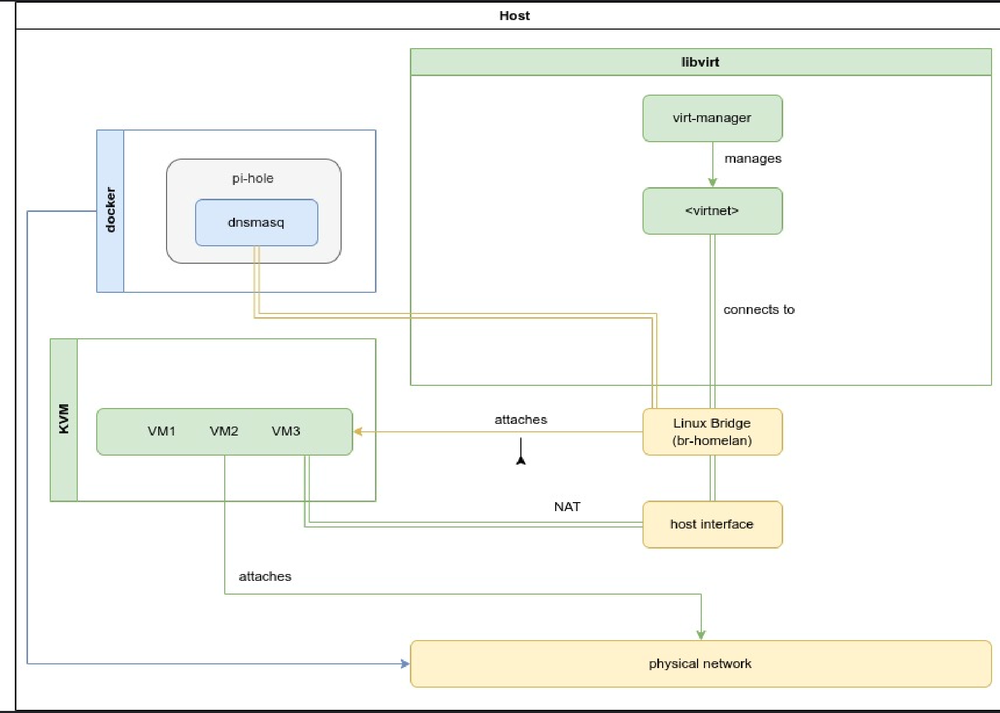

# Networking - Homelab

### 🔥 Good Choice for Homelab (advanced users)

Why?
- Fine-grained manual control (you set up everything yourself).
- DHCP/NAT services (you need to configure yourself)
- No Integration with virt-manager or virsh
- No Portable (attached to the host). Create a VM for this lab instead.


###  🤓 Linux bridge

A Linux bridge (like one created with brctl or ip link add type bridge) is a very basic, low-level network switch at layer 2 (Ethernet). It's simple, flexible, and widely used — especially outside of virtualization too. You manually manage it: create the bridge, add interfaces (like tap devices or physical NICs), set up IPs and routing if needed.

For this lab, I will use pi-hole as a DNS server and DHCP server. The bridge will be used to connect all the VMs and Docker containers together.


**Expected**

Everyone is on the same bridge → Same subnet (like 192.168.8.0/24) → Full communication ✅
```
[ Host Machine ]
    |
    |-- br-homelan (Linux Bridge) <--- All attached here
          |
          |-- [Docker Containers]
          |-- [Minikube]
          |-- [VM1]
          |-- [VM2]
          |-- [Host Itself]
```

### **Requisites**

Remove or disable all virsh networks if present, since libvirt uses dnsmasq for DHCP and DNS. This can cause conflicts with your own DHCP server (like Pi-hole).
```
⋊> ~ sudo virsh net-list --all                                                                 
[sudo] password for avictoria:
 Name          State      Autostart   Persistent
--------------------------------------------------
 default       active     no          yes

```
default → virbr0
```
5: virbr0: <BROADCAST,MULTICAST,UP,LOWER_UP> mtu 1500 qdisc htb state UP group default qlen 1000
    link/ether 52:54:00:78:4a:a1 brd ff:ff:ff:ff:ff:ff
    inet 192.168.122.1/24 brd 192.168.122.255 scope global virbr0
       valid_lft forever preferred_lft forever
```
### 👀 **Steps**

### **Step 1: Create a Linux bridge (br-homelan)**

1. Create a bridge interface (br-homelan) and assign an IP address to it.
```sh
# Install required packages (sudo pacman -Rdd iptables)
sudo pacman -Syu bridge-utils dnsmasq iptables-nft

# Create bridge
sudo ip link add name br-homelan type bridge

# Assign an IP to the bridge (new subnet, example 192.168.100.1/24)
sudo ip addr add 192.168.8.1/24 dev br-homelan

# Bring up the bridge
sudo ip link set br-homelan up
```

Create dummy interface for host access
```sh
sudo ip link add d0-homelan type dummy
sudo ip link set d0-homelan master br-homelan
sudo ip link set d0-homelan up
```

```sh
⋊> ~ nmcli con show                                                                                                                                                                            18:27:22
NAME                     UUID                                  TYPE       DEVICE
AltiboxWIFI              8ab46a0e-0000-0000-0000-098360ad2e6a  wifi       wlan0
br-homelan               ffeb0190-0000-0000-0000-6181afe69062  bridge     br-homelan
lo                       c78b5dd3-0000-0000-0000-35ddf9b63df6  loopback   lo
d0-homelan               19f6decc-0000-0000-0000-778b657713b4  dummy      d0-homelan
docker0                  8bfb397a-0000-0000-0000-1cb0bffd278b  bridge     docker0
virbr0                   3f42e274-0000-0000-0000-a299716b5c70  bridge     virbr0
```
**⚡ Hint:** 
ip link add is not persistent across reboots by default.

```sh
# overwrite any old config
nmcli -f connection con show br-homelan

# sudo nmcli connection modify br-homelan ipv4.addresses 192.168.8.1/24
sudo nmcli connection modify br-homelan connection.autoconnect false
sudo nmcli connection modify br-homelan ipv4.method manual
sudo nmcli connection modify br-homelan ipv6.method disabled
sudo nmcli connection modify br-homelan bridge.stp true
sudo nmcli connection modify br-homelan bridge.forward-delay 2
# Check if the file is created
sudo ls /etc/NetworkManager/system-connections/
```
⚡ **Important:**
Don't add wlan0 to the bridge directly. Instead, enable IP forwarding and NAT between br-homelan and wlan0.

🔥 After Bridge Creation
Then enable NAT + forwarding:

2. Enable IP forwarding:
```sh
echo "net.ipv4.ip_forward=1" | sudo tee -a /etc/sysctl.d/99-sysctl.conf
sudo sysctl -p
```
3. Set up NAT:
```sh
# Replace wlan0 if your wireless interface has a different name
sudo iptables -t nat -A POSTROUTING -s 192.168.8.0/24 -o wlan0 -j MASQUERADE
#sudo iptables -t nat -A POSTROUTING -o wlan0 -j MASQUERADE
sudo iptables -A FORWARD -i br-homelan -o wlan0 -j ACCEPT
sudo iptables -A FORWARD -i wlan0 -o br-homelan -m state --state RELATED,ESTABLISHED -j ACCEPT

```

After you have all your working rules (NAT, FORWARD, etc.), save them:
4. Now, anytime you need to save your iptables rules, you can just run:
```sh
sudo iptables-save | sudo tee /etc/iptables/iptables.rules > /dev/null

# sh script
sudo chmod +x /usr/local/bin/save-iptables.sh
sudo save-iptables.sh
```

**⚡ Hint:** Restore without rebooting
```sh
sudo iptables-restore < /etc/iptables/iptables.rules
```
Enable the service that loads rules at boot
```sh
sudo systemctl enable iptables
sudo systemctl start iptables
```
### **Step 2: DNS 🐳 Create a custom Docker bridge for Pi-hole**

```sh
systemctl status systemd-resolved
sudo sed -r -i.orig 's/#?DNSStubListener=yes/DNSStubListener=no/g' /etc/systemd/resolved.conf
sudo cp /etc/resolv.conf /etc/resolv.conf.bak
sudo sh -c 'rm /etc/resolv.conf && ln -s /run/systemd/resolve/resolv.conf /etc/resolv.conf'
systemctl restart systemd-resolved
```


```sh
docker network create \
  --driver=bridge \
  --subnet=192.168.8.0/24 \
  --gateway=192.168.8.1 \
  -o com.docker.network.bridge.name=br-homelan \
  docker-homelan
```

```sh
docker run -d \
  --name svc.pihole \
  --hostname pihole.local-lab.site \
  --network docker-homelan \
  --ip 192.168.8.2 \
  -e TZ="Australia/Melbourne" \
  -e WEBPASSWORD="yourpassword" \
  -e DHCP_ACTIVE="true" \
  -e DHCP_START="192.168.8.100" \
  -e DHCP_END="192.168.8.200" \
  -e DHCP_ROUTER="192.168.8.1" \
  -e DHCP_LEASETIME="24h" \
  -e PIHOLE_INTERFACE="br-homelan" \
  --cap-add=NET_ADMIN \
  -v "$(pwd)/etc-pihole:/etc/pihole" \
  -v "$(pwd)/etc-dnsmasq.d:/etc/dnsmasq.d" \
  --restart unless-stopped \
  pihole/pihole:latest
```
🔥 [docker-compose](../pihole/docker-compose.png) file

you can also run a simple alpine container to test the network
```
docker run  \
--name alpine-test --hostname alpine-test \
--network docker-homelan --ip 192.168.8.10 --dns 192.168.8.1 \
-it alpine sh
```
Remember docker uses its own DNS

### **Step 3: Update Libvirt (virt-manager) to use the bridge**

Configure libvirt to use br-homelan by creating a new network based on the file [br-homelan.xml](libvirt/br-homelan.xml) file, then load it into libvirt:
```sh
virsh net-define br-homelan.xml
virsh net-start br-homelan
virsh net-autostart br-homelan
````
Open virt-manager GUI

Edit → Connection Details → Virtual Networks → Disable virbr0 if you want

Instead: 
- Add new NIC to VM
- Network source → Specify shared device name → Type br-homelan
- Device model → virtio (faster)


### **Step 3: DNS and DHCP for VMs **
Option 1: Manually set DNS inside the VM
In the VM (Linux guest), edit /etc/resolv.conf:
`/etc/resolv.conf`

```conf
nameserver 192.168.8.2
```

To obtain an IP address from the DHCP server (Pi-hole), set the network interface to use DHCP.
`/etc/network/interfaces`
```conf
auto lo
iface lo inet loopback

auto eth0
iface eth0 inet dhcp
```
**⚡ Hint:** Alternatively, you can set a static IP address in the VM:
```conf
iface eth0 inet static
    address 192.168.8.100
    netmask 255.255.255.0
    gateway 192.168.8.1
```
✅ Now DNS resolution should work.

```
[ Host 192.168.8.1 ]
    |-- bridge-slave (NAT) <--- attached to wlan0
      |-- br-homelan (bridge) <--- All attached here
      |-- * pi-hole; (DHCP && DNS)
        |
        |-- [VM1 192.168.8.10] (virt-manager, bridged to br-homelan)
        |-- [VM2 192.168.8.201]  (virt-manager, bridged to br-homelan)
        |-- [VM2 192.168.8.202]  (virtualbox, bridged to br-homelan)      
        |-- [Container1 192.168.8.2] (Pi-hole Docker with bridge on br-homelan)
        |-- [Container2 192.168.8.21] .. portainer...
```

```
                       [ Internet ]
                            |
                        [ wlan0 ]
                            |
                   ( NAT / MASQUERADE )
                            |
                   [ Host - Arch Linux ]
                        192.168.8.1
                            |
                      [ br-homelan ]
         -------------------------------------------------
        |             |               |                |
 [VM1 - virt-manager] [VM2 - virt-manager] [VM3 - VirtualBox] [Docker Containers]
  192.168.8.10         192.168.8.201       192.168.8.202  
                                                                      |                 
                                               ------------------------------------------
                                              |                                          |
                                   [Container1 - pi-hole]                    [Container2 - Portainer]
                                     192.168.8.2                                 192.168.8.21

```