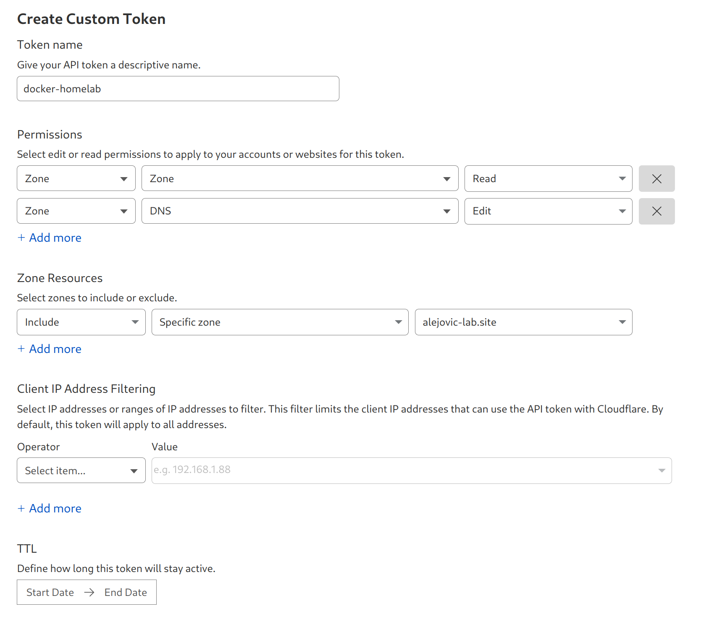
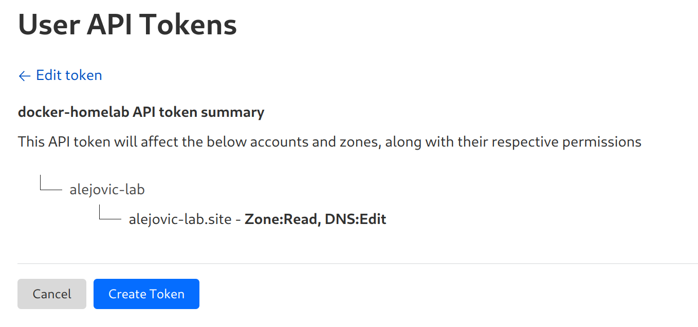
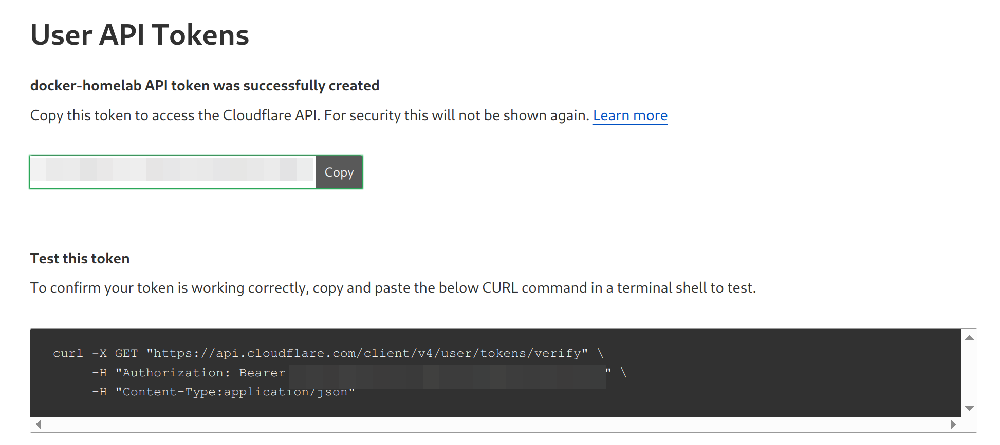

# Traefik - Homelab

### 🔥 Best Choice for Homelab

Traefik is an excellent choice for a homelab reverse proxy. It simplifies routing and load balancing for your Docker containers and VMs, making it easy to manage multiple services with minimal configuration.

| Feature                                        | Why It’s Good for Homelabs                                                   |
| ---------------------------------------------- | ---------------------------------------------------------------------------- |
| 🔄 **Auto Service Discovery**                  | No need to manually define routes—just add labels to containers.             |
| 🔐 **Built-in HTTPS (Let's Encrypt)**          | Free HTTPS with automatic renewal is essential for secure internal services. |
| 🛠️ **Simple Configuration via Docker Labels** | Easy setup without needing to modify config files.                           |
| 📊 **Web UI Dashboard**                        | Visualize traffic, routes, and health of services.                           |
| 🧩 **Middleware Support**                      | Add authentication, redirects, or rate-limiting easily.                      |
| 🏠 **Homelab Friendly**                        | Works seamlessly with Docker Compose and static IPs/hostnames.               |


### 🤓 Traefik
Traefik is a modern reverse proxy and load balancer built for microservices and containerized environments (e.g., Docker, Kubernetes). It automatically discovers services and manages routing using labels—making it perfect for homelabs.

### Expected
- **Easy to integrate with Docker**: Traefik can automatically discover and route traffic to Docker containers based on labels.

Homelab Components:

* Host (Arch Linux) with:
* Docker containers:
  * Portainer
  * Pi-hole
  * Traefik
* KVM/QEMU VMs connected via a Linux bridge (e.g., br0)
* Public DNS: Cloudflare
* HTTPS: Let’s Encrypt (via Traefik)

```
                        +-------------------+
                        |  local-lab.sites  |
                        |  (Cloudflare DNS) |
                        +--------+----------+
                                 |
                          (Proxied DNS A record)
                                 |
                        +--------v----------+
                        | Public IP (Router)|
                        +--------+----------+
                                 |
                          Port Forwarding
                                 |
                        +--------v---------+
                        | Arch Linux Host  |
                        | (Docker, Traefik)|
                        +--+----------+----+
                           |          |
           +---------------+          +-----------------+
           |                                     |
   +-------v------+                      +--------v--------+
   | Traefik       |  <--- Docker --->   | Other Services   |
   | (Reverse Proxy|                     | (Portainer, Pi-hole, etc.) |
   +---------------+                    +-------------------+

```
### 👀 **Steps setup Traefik:**
### **Step 1: Cloudflare Configuration**
   - Set A record for `alejovic-lab.sites` pointing to your public IP.
   - Enable proxying (orange cloud).
   - Optional: Enable "Always use HTTPS", disable "Auto Minify", etc.
   - Generate an API token with permissions to edit DNS records and save it in `cf_api_token.txt`.




### **Step 2: Traefik Configuration**
```
traefik/
├── docker-compose.yml
├── .env
├── resources/
│   └── traefik.yml
│   └── acme.json
│   └── cf_api_token.txt
│   └── auth/
│       └── httpasswd
```
   - Create a `docker-compose.yml` file in the `traefik` directory.
   - Create a `traefik.yml` file in the `resources` directory.
   - Create an empty `acme.json` file in the `resources` directory and set permissions.
```shell
touch traefik/acme.json
chmod 600 traefik/acme.json
```
   - Generate a password for the Traefik dashboard and create a `.env` file with the credentials.
```shell
mkdir auth
docker run --entrypoint htpasswd httpd:2 -Bbn admin random_htpasswd > auth/htpasswd
sed -i "1s/^/TRAEFIK_DASHBOARD_CREDENTIALS=/" auth/htpasswd
cp auth/htpasswd ../.env
```

### **Step 3: Add Labels to Services**
Example for Pi-hole:
```yaml
labels:
    - "traefik.enable=true"
    - "traefik.http.routers.pihole.rule=Host(`pihole.local-lab.sites`)"
    - "traefik.http.services.pihole.loadbalancer.server.port=80"
    - "traefik.http.routers.pihole.entrypoints=web"
    - "traefik.http.routers.pihole.middlewares=auth"
```

## **Step 4: IP Whitelisting**

Update Traefik Labels to Use IP Whitelisting Middleware
```yaml
labels:
    - "traefik.http.middlewares.lanonly.ipwhitelist.sourcerange=192.168.8.0/24"
```
Apply Middleware to Routers

Example for Pi-hole:
```yaml
labels:
  - "traefik.enable=true"
  - "traefik.http.routers.pihole.rule=Host(`pihole.${DOMAIN}`)"
  - "traefik.http.routers.pihole.entrypoints=websecure"
  - "traefik.http.routers.pihole.tls.certresolver=letsencrypt"
  - "traefik.http.routers.pihole.middlewares=lanonly"
  - "traefik.http.services.pihole.loadbalancer.server.port=80"
```

### Troubleshooting
```yaml
  # Example service
  whoami:
    image: traefik/whoami
    labels:
      - "traefik.enable=true"
      - "traefik.http.routers.whoami.rule=Host(`whoami.local.${DOMAIN}`)"
      - "traefik.http.routers.whoami.entrypoints=https"
      - "traefik.http.routers.whoami.tls.certresolver=letsencrypt"
    networks:
      docker-homelan:
        ipv4_address: 192.168.8.101
    dns:
      - 192.168.8.1
    depends_on:
      - traefik
```

✅ What actually happens:
You visit https://whoami.local.local-lab.site from a laptop
1. Laptop asks Pi-hole to resolve it
2. Pi-hole returns 192.168.8.1
3. Your laptop makes an HTTPS request to 192.168.8.1
4. Traefik (listening on host ports) receives it
5. Traefik routes it to the right Docker container (via Docker's internal network)
```
                      ┌────────────────────────────┐
                      │     Your Laptop / Phone    │
                      │  Requests:                 │
                      │  https://whoami.local...   │
                      └────────────┬───────────────┘
                                   │ DNS query
                                   ▼
                     ┌─────────────────────────────┐
                     │          Pi-hole            │
                     │  Resolves:                  │
                     │  whoami.local.local-lab..   │
                     │      ➝ 192.168.8.100        │
                     └────────────┬────────────────┘
                                  │
                                  ▼
               ┌────────────────────────────────────┐
               │      Browser connects to host:     │
               │     https://192.168.8.100:443      │
               └──────────────┬─────────────────────┘
                              │
                              ▼
                    ┌──────────────────────┐
                    │       Traefik        │
                    │ Listens on :80/:443  │
                    │                      │
                    │ Routes by Hostname:  │
                    │ whoami.local.loca... │
                    │      ➝ whoami svc    │
                    └──────────┬───────────┘
                               │
                Docker internal network (e.g., traefik)
                               │
                               ▼
                   ┌──────────────────────┐
                   │   whoami container   │
                   │  Exposes port 80     │
                   └──────────────────────┘

```